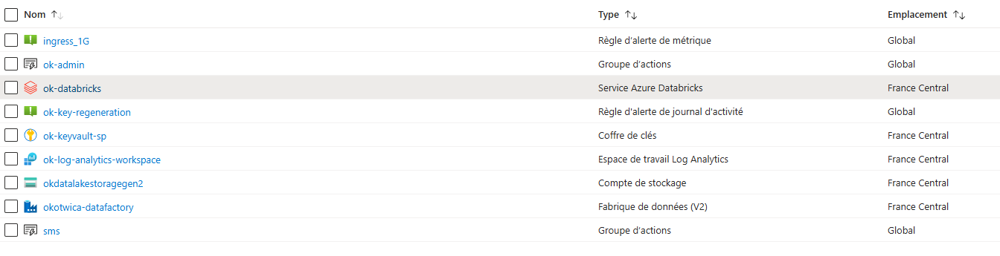
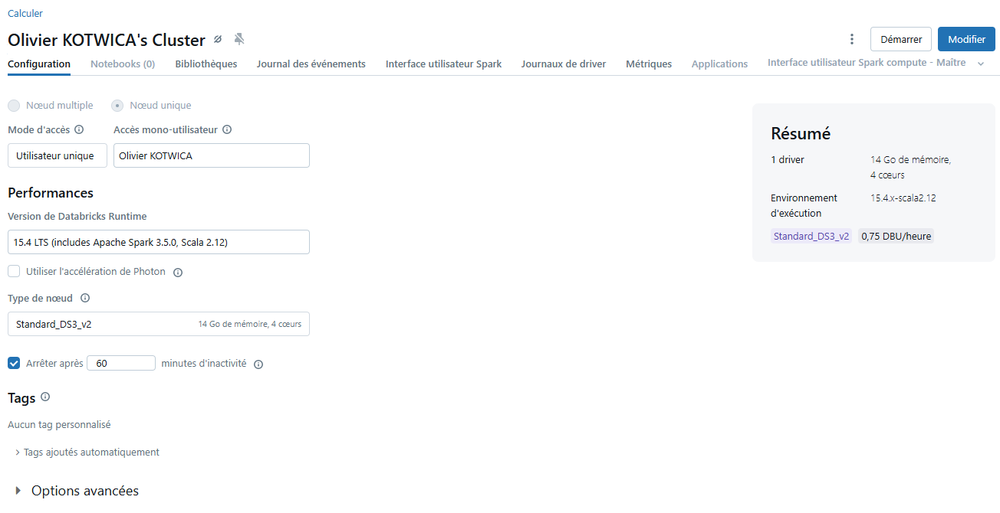
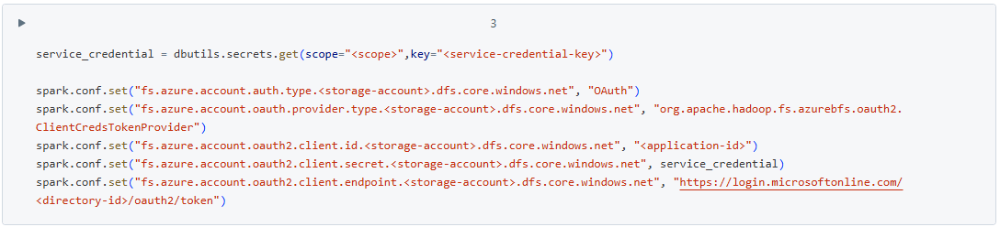
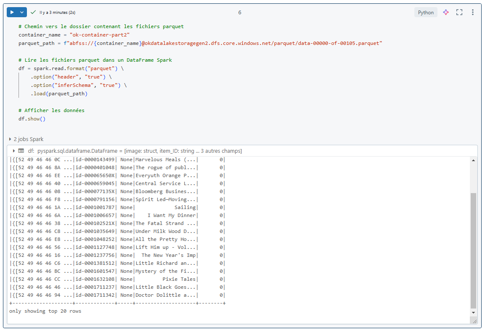

# **configuration databricks**

Creation de la ressource `Databricks` dans mon groupe de ressource sans reelles complications en suivant les tutoriels azure.

# 

Ci dessous la capture de la configuration du cluster databricks à associer au notebook.

# 

Ci dessous un exemple de code fourni dans le tutoriel azure pour connecter databricks au datalake (sans les infos sensibles ...).

# 

Ci dessous la capture de la cellule du notebook databricks qui premet de charger et afficher les premieres lignes d un fichier parquet du datalake.

