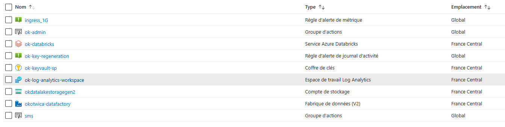
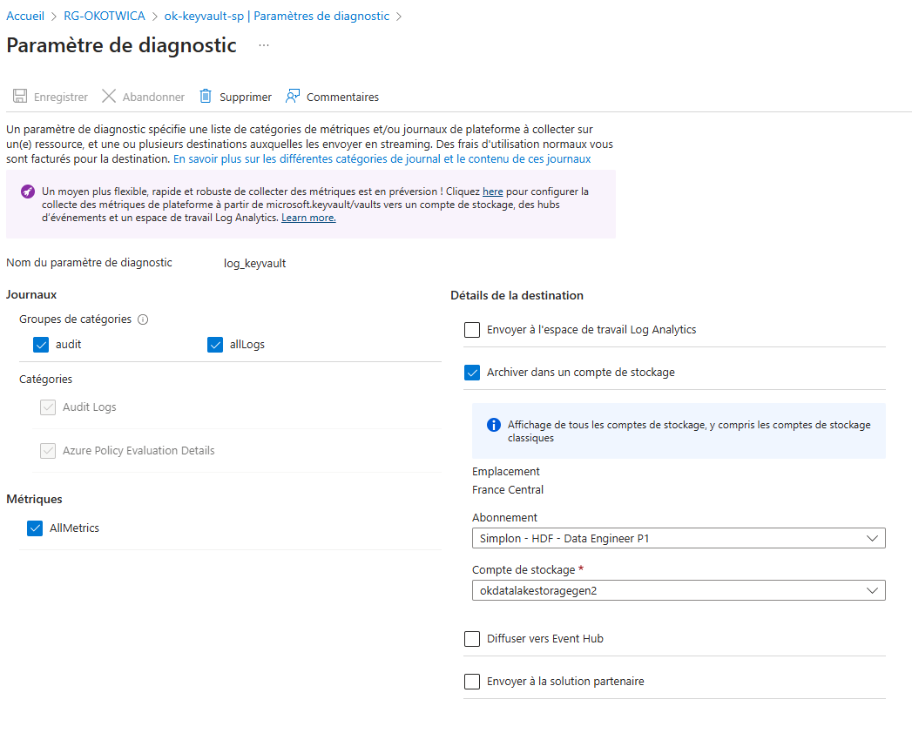
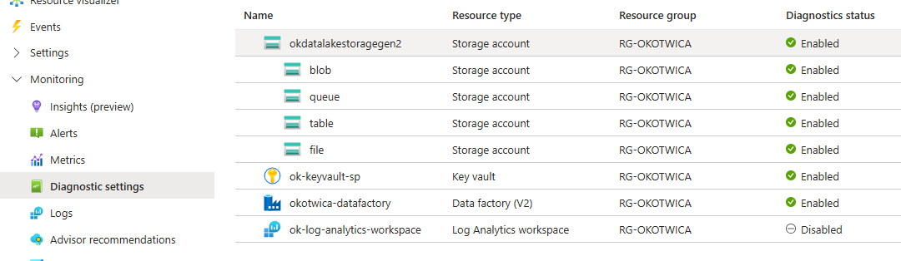
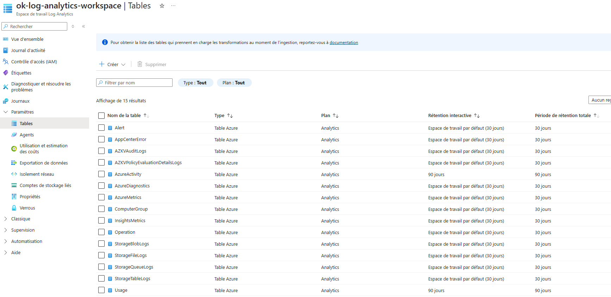
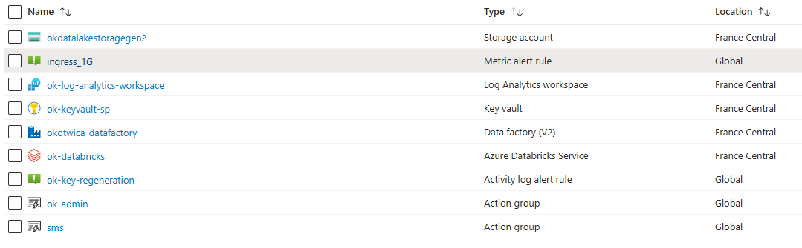
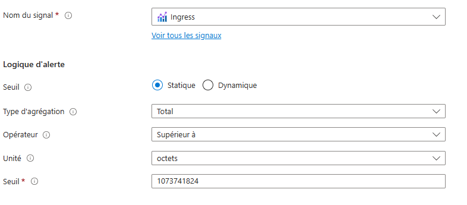
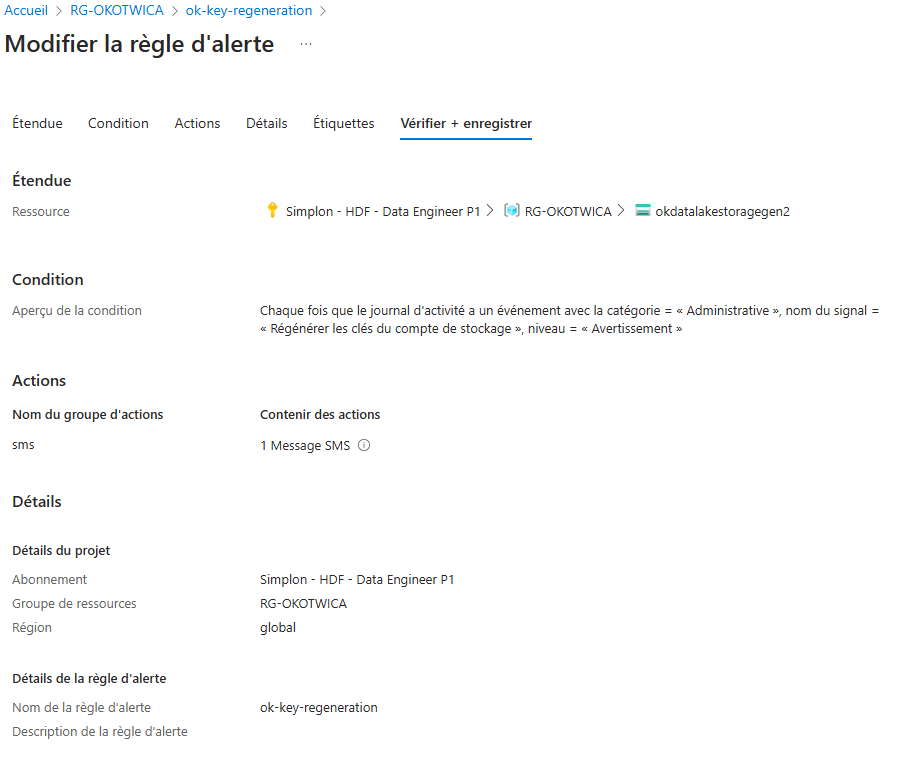
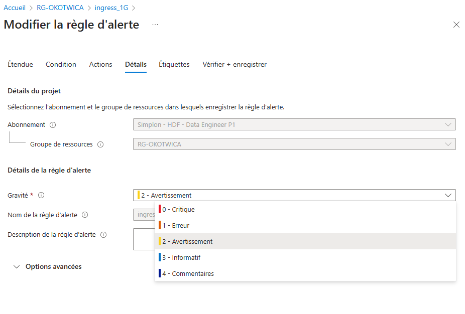
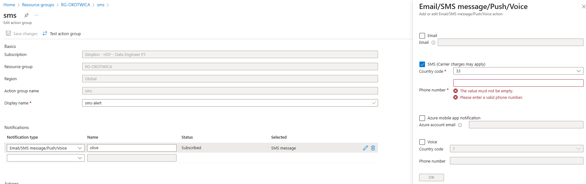

# **Monitoring et Alertes**

## **Log Analytics Workspace**

Creation de la ressource `Logs Analytics Workspace` dans mon groupe de ressource.

Capture du parametrage pour remonter les logs du `keyvault` dans le `Logs Analytics Workspace`.

Il faut effectuer ce parametrage sur les differentes ressources dont on veut remonter les logs dans le `Logs Analytics Workspace`. On peut visualiser ce parametrage  dans le groupe de ressource dans *Monitoring>Diagnostic settings*.

On peut egalement visualiser les tables de logs qui sont crées dans le `Logs Analytics Workspace`. On pourra par la suite requeter ces tables.

## **Metrics**

## **Insights**

## **Alerts**

Creation d `Alerts` dans le groupe de ressource dans *Monitoring>Alerts*.

Paramétrage d une alerte sur une `métrique`. 

Paramétrage d une alerte sur les `Activity Logs`

Paramétrage de la `gravité` d une alerte.

Creation d un `groupe d action` avec un mode de notification (sms, mail, ...) à attribuer à une alerte.
